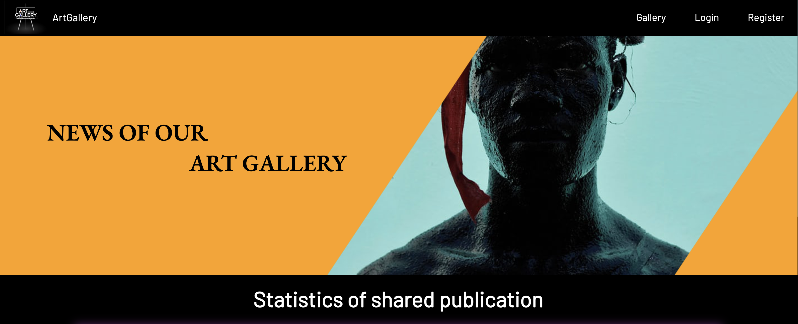

# 🎨 Art Gallery

Welcome to **Art Gallery**! 🖼️ A web platform where users can create profiles, upload, edit, and delete their artworks. It's the perfect place to showcase your creativity! ✨


## 🌟 Features

- 🧑‍💻 **User Registration & Login**: Sign up to create your profile and start sharing your art!
- 🖼️ **Upload Art**: Add new pieces to your gallery.
- ✏️ **Edit Art**: Update your existing uploads anytime.
- 🗑️ **Delete Art**: Remove your artwork whenever you want.
- 🔐 **Secure Authentication**: Powered by JWT (JSON Web Tokens) and bcrypt for safe password encryption.

## 🛠️ Technologies Used

- **Backend**: Express.js
- **Database**: MongoDB & Mongoose
- **Authentication**: JSON Web Tokens (JWT) & bcrypt
- **Templating**: Handlebars
- **Environment Management**: dotenv

## 🚀 Getting Started

1. Clone the repository:
   ```bash
   git clone https://github.com/stoyangalchev/Art-gallery
   ```
2. Install dependencies:
   ```bash
   npm install
   ```
3. Set up your environment variables:
   - Create a `.env` file in the root directory and add the following:
     ```
     PORT=5000
     DB_CONNECTION_STRING=your_mongo_db_uri
     JWT_SECRET=your_jwt_secret
     AUTH_COOKIE_NAME=auth_jwt
     PORT = 3000

     ```
4. Start the application:
   ```bash
   npm start
   ```

## 🤝 Contributing

Feel free to open issues or submit pull requests. Let's make this platform better together!

## 📜 License

This project is licensed under the MIT License.

---

Enjoy building your art gallery! 🎨✨

